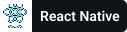
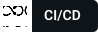

<h3 align="center">
  Welcome to Dulan Wirajith's profile!
  
</h3>

  

### I'm a Learner, Developer, and a Content Creator!

- 🔭 I’m currently working with Node.js, NestJS, Express.js, React, Graphql, MongoDB, TypeScript, etc.  🥷
- 🌱 I’m currently learning Node.js Security Best Practices, NestJS and Blockchain
- 💬 Ask me about anything related to JavaScript/ TypeScript
- 🥅 2023 Goals: Advancing in the current field 
- 📫 How to reach me: [dulanwirajith][linkedin]
- ⚡ Fun fact: I love to listen and read articles
- 🚴🏽‍♀️ Life Quote: Life is like riding a bicycle, to keep your balance, you must keep moving

### Connect with me:

[//]: # ([![Website]&#40;https://img.shields.io/website?label=dulanwirajith.com&style=for-the-badge&url=https%3A%2F%2Fdulanwirajith.com&#41;]&#40;https://dulanwirajith.com&#41;)

### My Github Trophies

### My Streak stats

### Github Profile Summary Card

### Languages :

   &emsp;
   &emsp;
   &emsp;
   &emsp;
   &emsp;
   &emsp;
   &emsp;

### Back-End :

   &emsp; 
   &emsp; 
   &emsp; 
   &emsp;  
   &emsp;  

### Front-End :

   &emsp;
   &emsp;
   &emsp;
   &emsp;
   &emsp;

### Databases :

   &emsp;
   &emsp;
   &emsp;
   &emsp;

### DevOps :

   &emsp;
   &emsp;
   &emsp;
   &emsp;
   &emsp;
<!--    &emsp; -->

### IDE :

   &emsp;
   &emsp;
   &emsp;
   &emsp;

### My Github Stats :

<!--START_SECTION:waka-->
<!--END_SECTION:waka-->

[facebook]: https://www.facebook.com/dulan.wirajith
[medium]: https://medium.com/@dulanwirajith
[linkedin]: https://www.linkedin.com/in/dulanwirajith
[hackerrank]: https://www.hackerrank.com/dulanwirajith?hr_r=1
[portfolio]: https://www.dulanwirajith.com
[upwork]: https://www.upwork.com/o/profiles/users/~010462f3cdf452b722/

