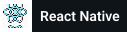
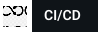

<h3 align="center">
  Welcome to Dulan Wirajith's profile!
  
</h3>

  

### I'm a Lover, Learner, Developer, and Content Creator!

- 🔭 I’m currently working with Nodejs, Nest, Express, React, Graphql, Mongodb, Typescript, etc.  🥷
- 🌱 I’m currently learning React, Node, Nest and Blockchain
- 💬 Ask me about anything related to Javascript/ Typescript
- 🥅 2022 Goals: Stable my Life
- 📫 How to reach me: [dulanwirajith][linkedin]
- ⚡ Fun fact: I love to listen to everything and reading articles

### Connect with me:

[//]: # ([![Website]&#40;https://img.shields.io/website?label=dulanwirajith.com&style=for-the-badge&url=https%3A%2F%2Fdulanwirajith.com&#41;]&#40;https://dulanwirajith.com&#41;)

### My Github Trophies

### My Streak stats

### Languages :

   &emsp;
   &emsp;
   &emsp;
   &emsp;
   &emsp;
   &emsp;
   &emsp;

### Frameworks :

   &emsp;
   &emsp;
   &emsp;
   &emsp;
   &emsp;
   &emsp;
   &emsp;

### Tools :

   &emsp;
   &emsp;
   &emsp;
   &emsp;
   &emsp;
   &emsp;
   &emsp;
   &emsp;
<!--    &emsp; -->

### IDE :

   &emsp;
   &emsp;
   &emsp;
   &emsp;

### My Github Stats :

<!--START_SECTION:waka-->
<!--END_SECTION:waka-->

[facebook]: https://www.facebook.com/dulan.wirajith
[medium]: https://medium.com/@dulanwirajith
[linkedin]: https://www.linkedin.com/in/dulanwirajith
[hackerrank]: https://www.hackerrank.com/dulanwirajith?hr_r=1
[leetcode]: https://leetcode.com/dulanwirajith/
[portfolio]: https://www.dulanwirajith.com
[upwork]: https://www.upwork.com/o/profiles/users/~010462f3cdf452b722/

